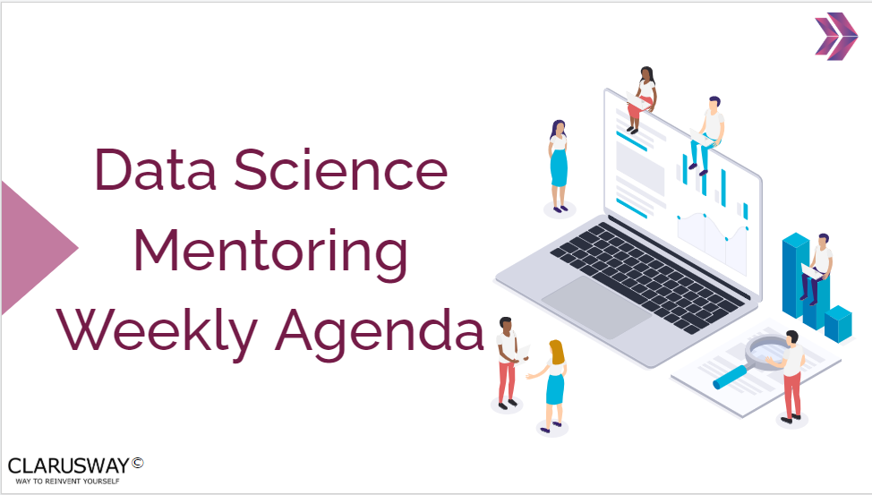

<h1><strong>Week-6 (November 11th - 17th, 2024)</strong>

 

<h1><strong>Meeting Agenda</strong></h1>

▶ Icebreaking (10m) 

▶ Micro Learning & Presentations (55m) 

▶ Project Discussion (10m)

 
 
 

<h1><strong>Teamwork Schedule</strong></h1>

<table style= "width:100%;">
                <tr>
                <td style="color: #FA8072; text-align:left "><h3><strong>
Ice-breaking</td>
                <td style="color: #FA8072; text-align:right;"><h3><strong>
10m
<td>                </tr>
</table>

- Personal Questions 
- Any challenges (Classes, Coding, studying, etc.) 
- How you’re studying? Do you need personal advice? 
- Remember that practice makes perfect. 
- What exactly does each student do for the team, if they know each other, if they care for each other, if they follow and talk with each other etc? 

 
 

<table style= "width:100%;">
                <tr>
                <td style="color: #FA8072; text-align:left "><h3><strong>
Micro Learning & Presentations</td>
                <td style="color: #FA8072; text-align:right;"><h3><strong>
55m
<td>                </tr>
</table>
(The problems and subjects in this part, have been prepared especially for you to equip yourself for the interview process and improve your coding skills. 
To get the most from this part, it’s highly recommended to be prepared and present the topics in English/German.
We strongly suggest that you force yourself to present especially the interview questions in English/German. 
This part's main and only aim is to develop the skills you need during and after the recruitment process and prepare you for the DS career.)

                  
  
<h3><strong>Questions & Problems Related to Course Topics</strong></h4>

**1. There is a hands-on related to this week's subjects (Stats) in the notebook below. Try to code!**
   
   - [Stats Hands-on](https://github.com/clarusway/DS-DE1024-EN-DA-Students/blob/main/2-%20Weekly%20Agendas/DA_6%20Agenda/Stats_HandsOn-1_Student.ipynb)

**2. Please work on the GSS exercises below. (Don't forget to make your own copy!)**
   
   - [GSS Practice-1](https://docs.google.com/spreadsheets/d/1AJMZ8sXZsw_dboHIirnzQNnV6DSjWUTq9EONh5Oj9q4/edit#gid=121431986)

  
<h3><strong>Interview Questions</strong></h4>

**1. What do you mean by confidence interval in statistical analysis?**

**2. What is Bayes' Teorem?**

**3. What is the law of large numbers in statistics?**

**4. What is a hypothesis?**

**5. What is the difference between type I vs type II errors?**

 

<table style= "width:100%;">
                <tr>
                <td style="color: #FA8072; text-align:left "><h3><strong>
SELF STUDY - ADDITIONAL RESOURCES</td>
                </tr>
</table>

**1. Please read/watch the following articles/videos related to this week's topics, which you can discuss within the group. The articles/videos shared with you below will help you better understand the topics.**

   **Articles**

     - [Hypothesis Testing](https://www.simplilearn.com/tutorials/statistics-tutorial/hypothesis-testing-in-statistics)

     - [Statistical Testing: How to select the best test for your data?](https://towardsdatascience.com/statistical-testing-understanding-how-to-select-the-best-test-for-your-data-52141c305168)

     - [The Concept Of Hypothesis Testing in Probability and Statistics!](https://www.analyticsvidhya.com/blog/2021/08/the-concept-of-hypothesis-testing-in-probability-and-statistics/)

     - [Understanding Hypothesis Testing](https://towardsdatascience.com/understanding-hypothesis-testing-65f9b3e9ab1f)

     - [Understanding Hypothesis Testing](https://www.geeksforgeeks.org/understanding-hypothesis-testing/)

     - [Data Analysis in Excel: The Best Guide](https://www.simplilearn.com/tutorials/excel-tutorial/data-analysis-excel)

   **Videos**

     - [Hypothesis Testing and The Null Hypothesis, Clearly Explained!!!](https://www.youtube.com/watch?v=0oc49DyA3hU)  

     - [Alternative Hypotheses: Main Ideas!!!](https://www.youtube.com/watch?v=5koKb5B_YWo&list=PLblh5JKOoLUK0FLuzwntyYI10UQFUhsY9&index=12) 

     - [p-values: What they are and how to interpret them](https://www.youtube.com/watch?v=vemZtEM63GY&list=PLblh5JKOoLUK0FLuzwntyYI10UQFUhsY9&index=13)

     - [How to calculate p-values](https://www.youtube.com/watch?v=JQc3yx0-Q9E&list=PLblh5JKOoLUK0FLuzwntyYI10UQFUhsY9&index=14)

 

<table style= "width:100%;">
                <tr>
                <td style="color: #FA8072; text-align:left "><h3><strong>
PROJECT DISCUSSION</td>
                </tr>
                
</table>

**- [EDA Project (Analyze US Citizens)](https://academy.clarusway.com/path-player?courseid=ds-data-and-business-analytics-data-analysis-w-python-miscellaneous-for-premium-cohorts&unit=66e9d77a550a795ecc032e3eUnit)**  

**- [Stats Assignment-2 (CIs & Hypothesis Tests)](https://academy.clarusway.com/path-player?courseid=ds-data-and-business-analytics-statistics-for-premium-cohorts&unit=66b1e7a6a041336e7a0f033fUnit)**  

**- [Stats Case Study (Cardiovascular Disease)](https://academy.clarusway.com/path-player?courseid=ds-data-and-business-analytics-statistics-for-premium-cohorts&unit=66b1e7a7a041336e7a0f0341Unit)**  

**- [GSS Assignment-1 (Statistical Measures)](https://academy.clarusway.com/path-player?courseid=ds-data-and-business-analytics-google-sheets-miscellaneous-for-premium-cohorts&unit=66f2c5ec3209e099490a6cdcUnit)**  

**- Flipgrid: 6. What is p-value and how is it used?**
